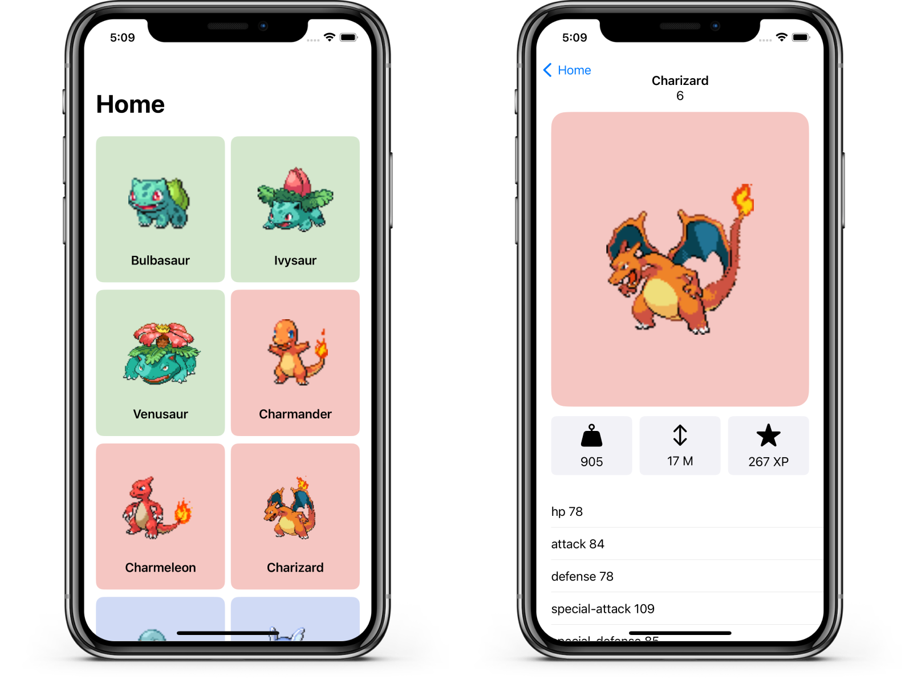

 

    

 

## 💻 Pokemon App

Application about pokemons, status and information...

    

 

## ♦️  Characteristics

- List of Pokemons with paginated loading from a public API.
- Pokemon detail display...
- Use of the MVVM design pattern to separate responsibilities and facilitate application expansion.
- Using SwiftUI to create declarative and responsive user interfaces.

 

## 🚀 Technologies Used

- Swift
- SwiftUI
- MVVM (Model-View-ViewModel)
- Public API for Pokemon data